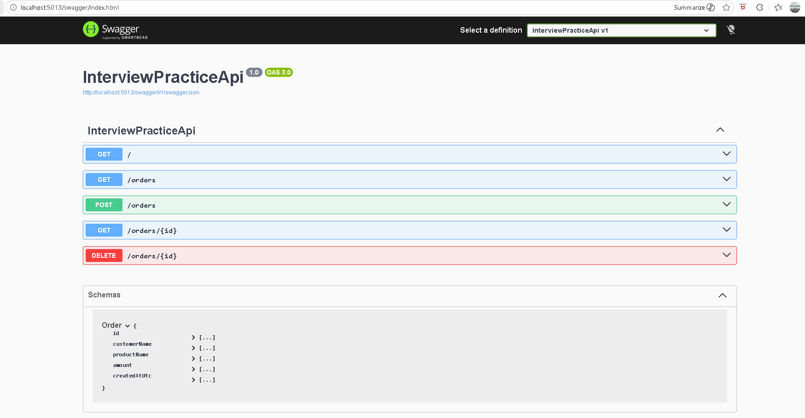
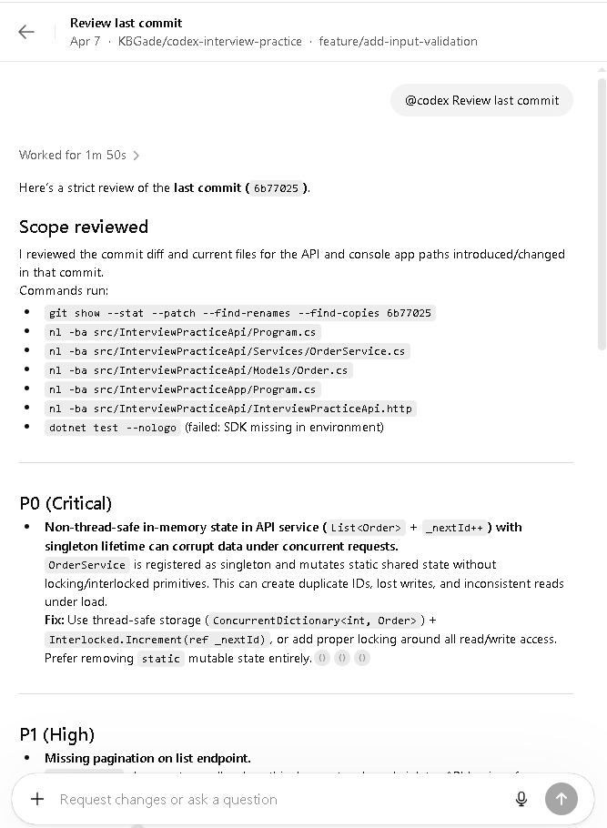
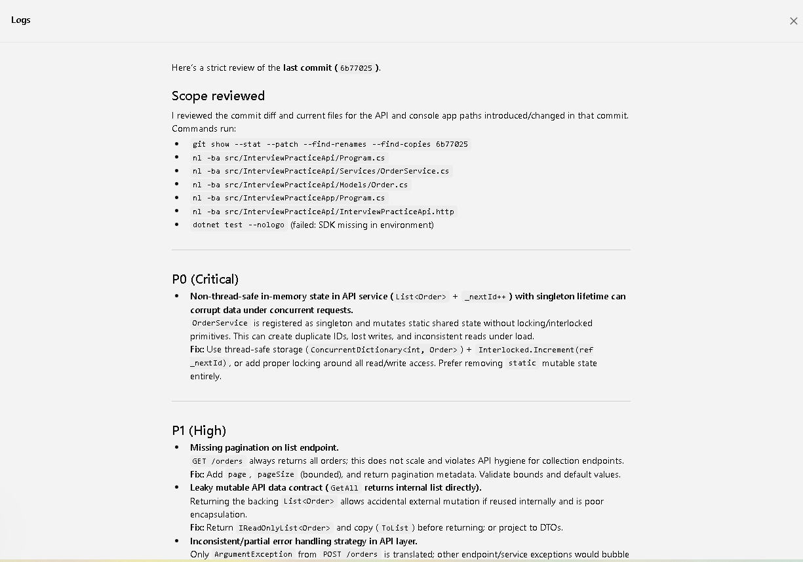

# Codex Interview Practice

A .NET interview practice repository used for coding exercises, API design, pull request workflows, and AI-assisted code review using Codex.

---

## 🚀 Current Project

Minimal ASP.NET Core Web API for Order Management.

---

## ✨ Features

- Create order
- Get all orders
- Get order by id
- Delete order
- Swagger (OpenAPI) integration
- Service layer with validation
- Clean minimal API design

---

## 🛠 Tech Stack

- C#
- ASP.NET Core Web API
- Swagger / OpenAPI
- VS Code
- Git & GitHub
- Codex (AI-assisted code review)

---

## 📁 Project Structure

```
src/
  InterviewPracticeApi/
tests/
AGENTS.md
README.md
.gitignore
codex-interview-practice.sln
```

---

## ▶️ Run Locally

```bash
dotnet restore
dotnet run --project src/InterviewPracticeApi/InterviewPracticeApi.csproj
```

Then open Swagger:

```
https://localhost:xxxx/swagger
```

---

## 📡 API Endpoints

### GET /
Health endpoint

### GET /orders
Returns all orders

### GET /orders/{id}
Returns order by id

### POST /orders
Creates a new order

Example request:

```json
{
  "customerName": "Kiran",
  "productName": "Laptop",
  "amount": 75000
}
```

### DELETE /orders/{id}
Deletes order by id

---

## 🤖 Codex Review Workflow

This project demonstrates AI-assisted code review using Codex.

### Workflow

1. Create feature branch
2. Implement changes
3. Push code to GitHub
4. Open Pull Request
5. Run Codex review
6. Apply improvements
7. Re-run review

---

## 🔍 What Codex Reviews

- Code quality
- API design
- Validation and error handling
- HTTP status code correctness
- Performance considerations
- Interview-level improvements

---

## 🧪 Example Codex Prompts

```
Review this pull request for:
- API design
- validation gaps
- status code correctness
- code quality
```

```
Act as a senior .NET backend engineer and review this PR.
```

---

## 📸 API Demo



## 📸 Codex Review Summary



## 📸 Detailed Review Output



---

## 💡 Purpose

This repository is designed to simulate a real engineering workflow:

1. Write code
2. Push changes
3. Open Pull Request
4. Review using Codex
5. Improve code based on feedback

---

## 🎯 Why This Project Matters

- Demonstrates real-world backend development
- Shows clean API design practices
- Highlights code review workflow
- Integrates AI-assisted engineering (Codex)
- Useful for senior .NET interview preparation